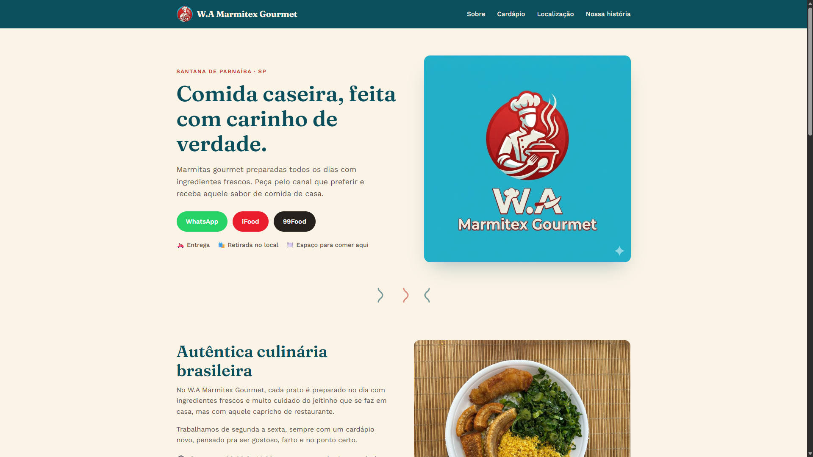

# 🍱 W.A Marmitex

Landing Page desenvolvida para o restaurante **W.A Marmitex**.

Projeto utilizado como laboratório para aplicar conceitos de Docker, AWS, Terraform e CI/CD em um ambiente real.

  

📍 Deploy realizado na AWS utilizando Docker, Amazon ECR e Amazon EC2.

---

## 🚀 Stack

**Frontend:** HTML • CSS • JavaScript

**DevOps:** Docker • Amazon ECR • Amazon EC2 • AWS CLI • SSH

---

## 📌 Roadmap

- ✅ Docker
- ✅ Amazon ECR
- ✅ Amazon EC2
- 🔜 Terraform
- 🔜 GitHub Actions
- 🔜 CI/CD

---

## 👨‍💻 Autor

Edilson Antonio dos Santos Junior
